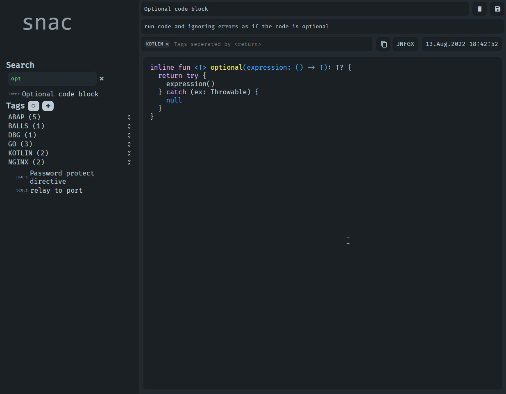

# This branch is not maintained as the project hast switched to Golang/VanillaJS

<div align="center">

  <h1>Devfile</h1>

  <p>
    snac is *the* snippet manager you, or your small Team, needs. Ever google the same thing multiple times a week, and then see your colleague also searching for the same piece of code? **No more!**

Now you can easily use snippets in any language (or in no language?!), with a simple table making use of Postgresql features, and a clean looking web frontend inspired by [Colors of GitHub Copilot](https://github.com/features/copilot).
  </p>


<!-- Badges -->
<p>
  <a href="https://github.com/Sett17/Devfile/graphs/contributors">
    
  </a>
  <a href="">
    
  </a>
  <a href="https://github.com/Sett17/snac/network/members">
    
  </a>
  <a href="https://github.com/Sett17/snac/stargazers">
    
  </a>
  <a href="https://github.com/Sett17/snac/issues/">
    
  </a>
</p>
</div>

<br />


## Screenshot



## Installation

Download the distribution zip and change the `config.yaml` to your liking then start the program.

```bash
./bin/snac path/to/config
or
./bin/snac.bat path/to/config
```

e.g.
```bash
./bin/snac ./config.yaml
```

The sql code to create the table and the needed function dn trigger in the [sql/](sql/).
The `table.sql` file should be executed last.

*NOTE: The sql files assume a user called `snac`.*

## Building

Simply run the `run` task with gradle with the path to the config file.

```bash
./gradlew run --args="./path/to/config"
```

## Config

Currently, all items in the `config-template.yaml` are needed.

Explanations for each configuration key are given in the `config-template.yaml` file.

## Frontend Usage

### Shortcuts
| Key          | Description                                                          | Context    |
|--------------|----------------------------------------------------------------------|------------|
| `ctrl+s`     | Saves the current snippet                                            | Everywhere |
| `ctrl+enter` | Re-Highlights the Snippet (is also done automatically after editing) | in Editor  |
| `tab`        | Inserts 2 spaces in current cursor position                          | in Editor  |

## Contributing
Pull requests are welcome. For major changes, please open an issue first to discuss what you would like to change.

## License
[MIT](https://choosealicense.com/licenses/mit/)
